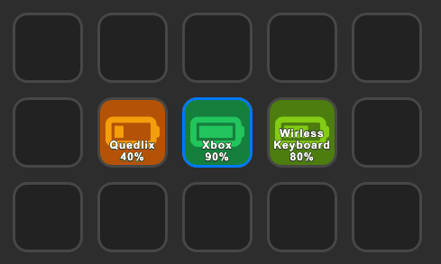

# Bluetooth Battery Monitor for Streamdeck

This plugin is used to show the battery % of bluetooth devices
Using [Bluetooth Battery Monitor](https://www.bluetoothgoodies.com/)

## Download

You can get the latest plugin release from the [releases page](https://github.com/Skulldorom/Bluetooth-Battery-Streamdeck/releases/latest)

## Requirements

- Paid version of the app is required
- Bluetooth Battery Monitor API enabled

### Enabling Bluetooth Battery Monitor API

The official [Documentation](https://www.bluetoothgoodies.com/info/battery-monitor-api/) from the developer

- Version used for Bluetooth Battery Monitor 2.22.0.1.

## Default Configuration

- API URL: `http://127.0.0.1:9876/devices`
- Device Number: 0
- Device Name: NONE
- Refresh Interval: 5 Minutes
- Animation Speed: 400ms

## Battery Icons

	
	
	
	
	
	

## Have Ideas or questions?

Head over to the [Discussions](https://github.com/Skulldorom/Bluetooth-Battery-Streamdeck/discussions)

# Troubleshooting

### API error

- If you are using a custom url please make sure it is correct
- If you are using the default ulr please paste the following into your browser and see if it returns a JSON `http://127.0.0.1:9876/devices`

### Device not found

Please check the device number is correct

### Recources

- [Maker CLI (Beta)](https://github.com/elgatosf/cli)
