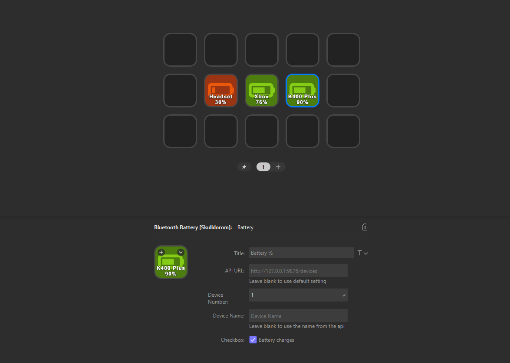

# Bluetooth Battery Monitor for Streamdeck

This plugin is used to show the battery % of bluetooth devices
Using [Bluetooth Battery Monitor](https://www.bluetoothgoodies.com/)

## Download

You can get the latest plugin release from the [releases page](https://github.com/Skulldorom/Bluetooth-Battery-Streamdeck/releases/latest)

## Requirements

- Paid version of the app is required
- Bluetooth Battery Monitor API enabled

### Enabling Bluetooth Battery Monitor API

The official [Documentation](https://www.bluetoothgoodies.com/info/battery-monitor-api/) from the developer

## Default Configuration

- API URL: `http://127.0.0.1:9876/devices`
- Device Number: 0
- Device Name: NONE
- Refresh Interval: 5 Minutes

## Battery Icons

